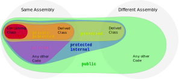

#### Call by Value / Reference
[relative link](./code/CallByValueOrReference.cs)

### Modifiers
#### 1. Accessibility

#### 2. static

#### 3. virtual, abstract, override, sealed override

#### 4. const vs readonly
[stackoverflow link](https://stackoverflow.com/questions/55984/what-is-the-difference-between-const-and-readonly-in-c)

#### 5. async

### Operators
for better understanding  
a?b:c   means if a == true then b, else c  
a??b    means if a == null then b, else a  
a??=b   means if a == null then a=b, else a=a

### delegates
    C#1.0 delegate:
    delegate returnType Function(params);

    C#2.0 anonymous functions:
    delegate (params) {method body}

    C#3.0 lambda expression:
    (params) => method body
    p.s. () Is mandatory when you need to mass more than one parameter

### Ordering rules by StyleCopAnalyzers
#### SA1201
To comply with this rule, elements at the file root level or within a namespace should be positioned in the following order:  

Extern Alias Directives  
Using Directives  
Namespaces  
Delegates  
Enums  
Interfaces  
Structs  
Classes  

Within a class, struct, or interface, elements should be positioned in the following order:

Fields  
Constructors  
Finalizers (Destructors)  
Delegates  
Events  
Enums  
Interfaces  
Properties  
Indexers  
Methods  
Structs  
Classes*  

### Default usage
#### Convert.ToString() vs .ToString()
Calling .ToString() presumes that the object is not null.  
Convert.ToString() can also handles null and will return **String.Empty**

# Data structures
## Array
1.create
    
    int[] array = new int[4];
    int[] array = new int[4] {1,2,3,4};
    int[] array = new int[] {1,2,3,4};
    int[] array = new [] {1,2,3,4};

2.Access

    lastElement = array[^1];                // indexing from the end
    int[] firstThreeElements = array[0..3]; // range